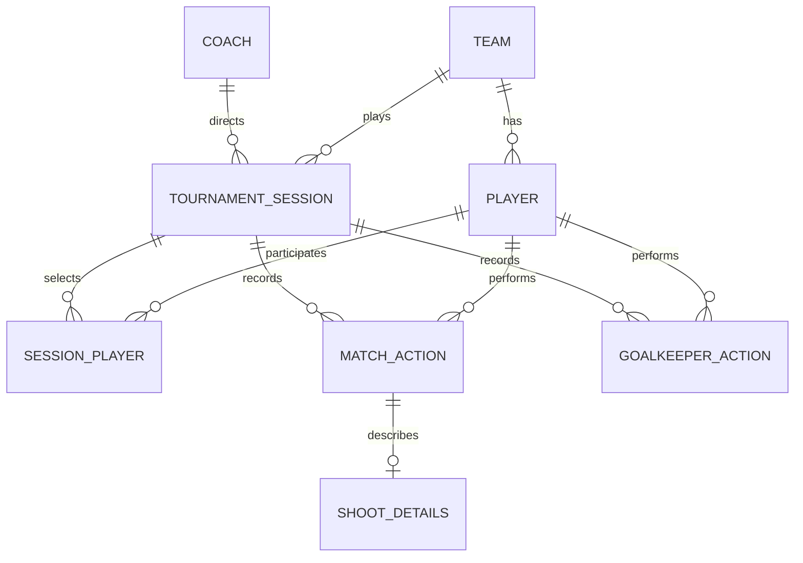

# Modelo de datos

## Entidades

### Coach

| Campo | Tipo | Regla |
|---|---|---|
| id | UUID | PK, generado en cliente |
| display_name | varchar(120) | obligatorio |
| created_at | timestamptz | UTC |
| updated_at | timestamptz | UTC |

### Team

| Campo | Tipo | Regla |
|---|---|---|
| id | UUID | PK |
| name | varchar(120) | obligatorio |
| category | varchar(80) | opcional |
| created_at | timestamptz | UTC |
| updated_at | timestamptz | UTC |

### Player

| Campo | Tipo | Regla |
|---|---|---|
| id | UUID | PK |
| team_id | UUID | FK Team |
| display_name | varchar(120) | obligatorio |
| jersey_number | smallint | 0–99 |
| default_role | enum | `SKATER`, `GOALKEEPER` |
| active | boolean | default true |

Restricción única: `(team_id, jersey_number)` para jugadores activos.

### TournamentSession

| Campo | Tipo | Regla |
|---|---|---|
| id | UUID | PK |
| tournament_name | varchar(160) | obligatorio |
| scheduled_date | date | obligatorio |
| start_time | time | opcional |
| team_id | UUID | FK Team |
| coach_id | UUID | FK Coach |
| active_goalkeeper_id | UUID | FK Player |
| status | enum | `DRAFT`, `IN_PROGRESS`, `PAUSED`, `FINISHED` |
| elapsed_ms | bigint | default 0 |
| started_at | timestamptz | opcional |
| finished_at | timestamptz | opcional |
| device_id | UUID | obligatorio |
| created_at | timestamptz | UTC |
| updated_at | timestamptz | UTC |

### SessionPlayer

| Campo | Tipo | Regla |
|---|---|---|
| session_id | UUID | PK/FK |
| player_id | UUID | PK/FK |
| role | enum | `SKATER`, `GOALKEEPER` |

### MatchAction

| Campo | Tipo | Regla |
|---|---|---|
| id | UUID | PK, igual a `client_event_id` en MVP |
| session_id | UUID | FK |
| player_id | UUID | FK |
| action_type | enum | `PASS`, `FAIL_PASS`, `ASSIST`, `SHOOT` |
| chronometer_ms | bigint | >= 0 |
| device_id | UUID | clave idempotente |
| client_event_id | UUID | clave idempotente |
| created_at | timestamptz | momento UTC del dispositivo |
| voided_at | timestamptz | opcional |
| void_reason | varchar(160) | opcional |
| version | integer | inicia en 1 |

### ShootDetails

| Campo | Tipo | Regla |
|---|---|---|
| action_id | UUID | PK/FK MatchAction |
| result | enum | `GOAL`, `MISSED`, `HIT_KEEPER`, `BLOCKED` |
| target_zone | enum | seis zonas del arco |
| keeper_side | enum | `GLOVE`, `PAD`, `UNKNOWN` |

Las seis zonas son: `TOP_LEFT`, `TOP_MIDDLE`, `TOP_RIGHT`, `BOTTOM_LEFT`, `BOTTOM_MIDDLE`, `BOTTOM_RIGHT`.

### GoalkeeperAction

| Campo | Tipo | Regla |
|---|---|---|
| id | UUID | PK |
| session_id | UUID | FK |
| goalkeeper_id | UUID | FK Player |
| shot_origin_zone | enum | `ZONE_1` … `ZONE_4` |
| result | enum | `SAVE`, `GOAL_ALLOWED` |
| chronometer_ms | bigint | >= 0 |
| device_id | UUID | clave idempotente |
| client_event_id | UUID | clave idempotente |
| created_at | timestamptz | UTC |
| voided_at | timestamptz | opcional |
| void_reason | varchar(160) | opcional |
| version | integer | inicia en 1 |

### SyncQueue — solo dispositivo

| Campo | Tipo | Regla |
|---|---|---|
| id | UUID | PK |
| entity_type | text | coach, team, player, sesión, plantilla, acción o acción de arquero |
| entity_id | UUID | referencia local |
| operation | enum | `UPSERT` |
| payload_json | text | snapshot serializado |
| state | enum | `PENDING`, `SYNCING`, `SYNCED`, `FAILED` |
| attempts | integer | default 0 |
| next_attempt_at | datetime | backoff |
| last_error | text | mensaje sanitizado |

## Relaciones

## Índices centrales

- `match_action(session_id, chronometer_ms)`.
- `goalkeeper_action(session_id, chronometer_ms)`.
- Único `match_action(device_id, client_event_id)`.
- Único `goalkeeper_action(device_id, client_event_id)`.
- `sync_queue(state, next_attempt_at)` en SQLite.
