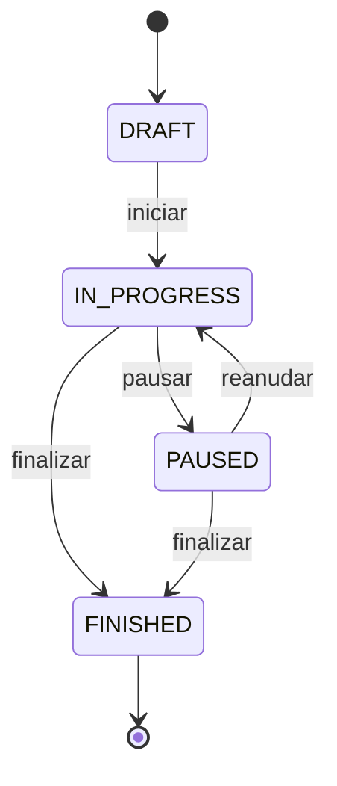

# Especificación funcional — MVP

**Feature ID:** `001-mvp`  
**Estado:** Ready for implementation  
**Producto:** Inline Hockey Coach

## 1. Problema

Durante un partido de hockey sobre patines en línea, el entrenador necesita registrar eventos rápidamente sin depender de papel ni de una conexión estable. La captura debe interferir lo mínimo posible con la observación del juego y producir estadísticas útiles al finalizar.

## 2. Usuarios

### Entrenador principal

- Configura sesiones y plantillas.
- Inicia, pausa y reanuda el cronómetro.
- Registra acciones de jugadores y arquero.
- Corrige la última acción.
- Consulta y finaliza el resumen.

### Ayudante del entrenador — fuera del MVP

Puede contemplarse posteriormente con edición concurrente y control de permisos.

## 3. Alcance MVP

### Incluido

- Gestión local de equipos, jugadores y entrenadores.
- Configuración de torneo/partido.
- Selección de jugadores activos y un arquero.
- Cronómetro ascendente con pausa y reanudación.
- Registro de pase correcto, pase fallido, asistencia y tiro.
- Detalle de resultado y zona objetivo para tiros.
- Registro de acciones del arquero por zona de origen y resultado.
- Historial reciente y anulación de la última acción.
- Resumen del partido.
- Cola offline y sincronización automática.
- Reintento manual de elementos fallidos.

### Fuera de alcance

- Autenticación social o SSO.
- Colaboración simultánea entre dispositivos.
- Video y seguimiento automático del puck.
- Estadísticas del rival.
- Gestión completa de campeonatos y tablas de posiciones.
- Notificaciones push.
- Exportación PDF/Excel.

## 4. Historias de usuario

### US-01 Configurar sesión — P1

Como entrenador quiero indicar torneo, fecha, hora, equipo, entrenador y plantilla para iniciar un partido con el contexto correcto.

**Aceptación**

- Torneo, fecha, equipo y entrenador son obligatorios.
- Debe seleccionarse al menos un jugador y exactamente un arquero.
- La sesión recibe UUID local y estado `DRAFT`.
- Puede crearse sin internet.

### US-02 Controlar cronómetro — P1

Como entrenador quiero iniciar, pausar y reanudar el cronómetro para asociar cada evento con el momento real del partido.

**Aceptación**

- El cronómetro inicia en `00:00`.
- El tiempo no avanza mientras está pausado.
- Cambiar de pantalla o bloquear brevemente el dispositivo no reinicia el tiempo.
- Cada acción guarda `chronometer_ms` calculado a partir de una referencia monotónica.

### US-03 Registrar acción de jugador — P1

Como entrenador quiero seleccionar un jugador y registrar pase, pase fallido, asistencia o tiro.

**Aceptación**

- Seleccionar un jugador abre el menú de acciones.
- `PASS`, `FAIL_PASS` y `ASSIST` se guardan con un segundo toque.
- `SHOOT` abre el selector de tiro.
- La escritura local ocurre antes de mostrar confirmación.

### US-04 Registrar tiro — P1

Como entrenador quiero indicar zona y resultado del tiro para analizar precisión y efectividad.

**Aceptación**

- Requiere una de seis zonas del arco.
- Requiere resultado `GOAL`, `MISSED`, `HIT_KEEPER` o `BLOCKED`.
- `GOAL` incrementa goles y tiros al arco.
- `HIT_KEEPER` incrementa tiros al arco, no goles.
- `MISSED` no incrementa tiros al arco.
- `BLOCKED` incrementa intentos, no tiros al arco.

### US-05 Registrar acción del arquero — P1

Como entrenador quiero registrar la zona de origen del disparo y el resultado para medir el desempeño del arquero.

**Aceptación**

- Requiere zona `ZONE_1` a `ZONE_4`.
- Requiere `SAVE` o `GOAL_ALLOWED`.
- La acción se asigna al arquero activo.
- El resumen muestra atajadas, goles recibidos y porcentaje de atajadas.

### US-06 Corregir última acción — P1

Como entrenador quiero anular rápidamente un error de captura.

**Aceptación**

- Solo el último evento no anulado de la sesión puede anularse desde captura rápida.
- Si no fue sincronizado se marca localmente como anulado; no se borra.
- Si fue sincronizado se envía su estado de anulación en el siguiente lote.
- El resumen excluye acciones anuladas.

### US-07 Sincronizar — P1

Como entrenador quiero que los datos se sincronicen automáticamente cuando vuelva internet.

**Aceptación**

- La app muestra `Sin conexión`, `Pendiente`, `Sincronizando`, `Sincronizado` o `Error`.
- Reconexión inicia sincronización con espera breve para evitar oscilaciones.
- Un reintento no duplica eventos.
- Fallos parciales permanecen pendientes con mensaje y contador de intentos.
- Ningún evento se pierde si la app se cierra después de guardarlo localmente.

### US-08 Resumen del partido — P2

Como entrenador quiero consultar resultados por jugador y arquero al finalizar.

**Aceptación**

- Totales del equipo: pases, pases fallidos, asistencias, intentos, tiros al arco y goles.
- Por jugador: mismos totales aplicables.
- Arquero: atajadas, goles recibidos, disparos enfrentados y porcentaje de atajadas.
- Distribución de tiros por zona.
- Puede consultarse offline.

## 5. Reglas de negocio

- BR-01: Una sesión pertenece a un equipo y a un entrenador.
- BR-02: Solo sesiones `IN_PROGRESS` aceptan nuevas acciones.
- BR-03: Cada acción pertenece exactamente a una sesión.
- BR-04: `shoot_details` existe únicamente cuando `action_type=SHOOT`.
- BR-05: Un jugador no puede ser simultáneamente jugador de campo y arquero activo en la misma sesión.
- BR-06: `chronometer_ms >= 0` y no puede superar el tiempo registrado de la sesión más una tolerancia de 5 segundos.
- BR-07: El porcentaje de atajadas es `saves / shots_faced * 100`; si no hay disparos, se muestra `—`.
- BR-08: Una sesión finalizada no acepta eventos nuevos, pero puede sincronizar pendientes.
- BR-09: IDs generados por cliente son UUID v4.
- BR-10: El servidor usa `(device_id, client_event_id)` como clave idempotente.

## 6. Requisitos no funcionales

- NFR-01: Registrar pase en menos de 300 ms después del toque, sin contar animación.
- NFR-02: Arranque usable de la pantalla de partido en menos de 2 segundos con datos locales.
- NFR-03: Soportar 5.000 eventos locales sin degradación perceptible.
- NFR-04: Lotes de sincronización de máximo 200 eventos.
- NFR-05: Tráfico mediante HTTPS en producción.
- NFR-06: Datos legibles y controles utilizables desde 320 px de ancho.
- NFR-07: No depender del color como único indicador.
- NFR-08: Logs no contienen nombres completos ni payloads deportivos completos en producción.

## 7. Estados principales

## 8. Decisiones pendientes para una versión posterior

- Duración reglamentaria configurable y períodos.
- Múltiples arqueros por partido y sustituciones.
- Registro de acciones del rival.
- Reglas específicas por liga o categoría.

