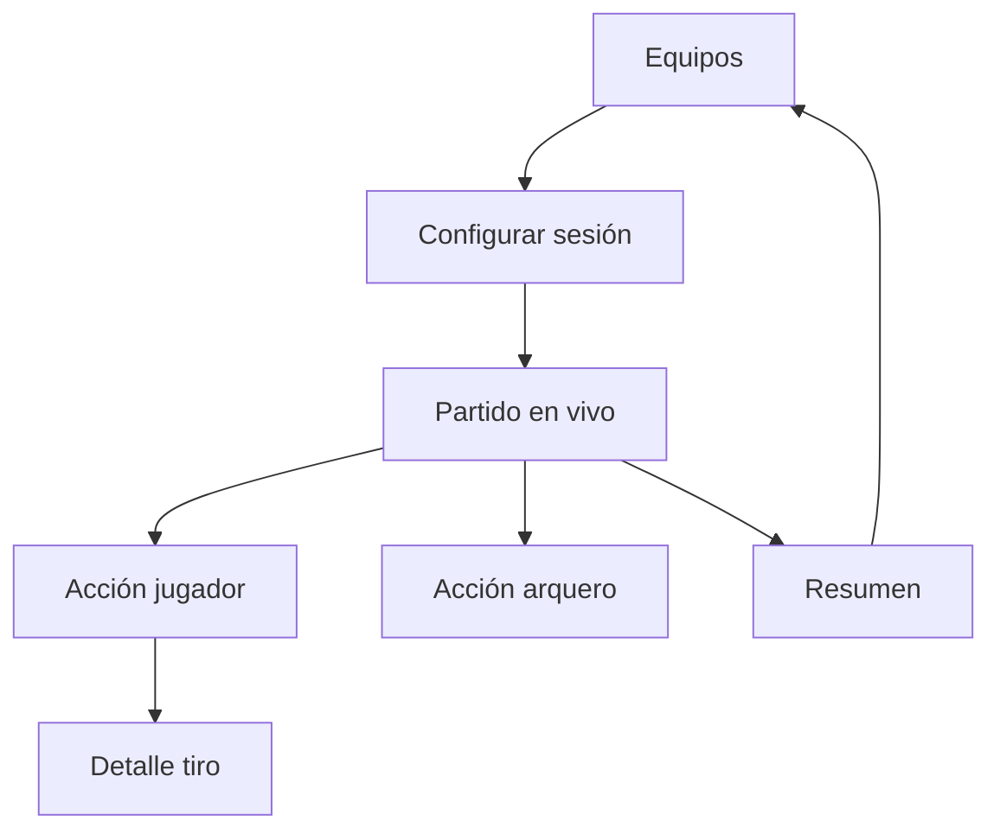

# UX y wireframes

## Principios

- Uso principal en tablet horizontal; compatible con móvil vertical.
- Acciones frecuentes visibles sin desplazamiento.
- Confirmación breve y no bloqueante.
- El estado de red siempre visible, sin impedir la captura.
- Botón de arquero visualmente diferenciado, pero accesible por etiqueta.

## Navegación

## Pantalla 1 — Configuración

- Nombre del torneo.
- Fecha y hora.
- Equipo.
- Entrenador.
- Jugadores participantes.
- Arquero activo.
- Acción principal: `Iniciar partido`.

Validaciones se muestran junto al campo y en un resumen accesible al intentar continuar.

## Pantalla 2 — Partido en vivo

### Encabezado

- Torneo y equipo.
- Cronómetro grande.
- Iniciar/pausar/reanudar.
- Indicador de sincronización con cantidad pendiente.

### Cuerpo

- Lista de jugadores a la izquierda o arriba en móvil.
- Cancha en el centro con cuatro zonas de origen.
- Acciones rápidas e historial reciente.
- Botón dedicado al arquero.

## Pantalla 3 — Menú de jugador

- Nombre y dorsal.
- Pase correcto.
- Pase fallido.
- Asistencia.
- Tiro.
- Cancelar.

`PASS`, `FAIL_PASS` y `ASSIST` se guardan inmediatamente. `SHOOT` avanza al arco.

## Pantalla 4 — Selector de tiro

El arco usa una matriz 2×3:

| Arriba izquierda | Arriba centro | Arriba derecha |
|---|---|---|
| Abajo izquierda | Abajo centro | Abajo derecha |

Después de la zona se elige: Gol, Fallido, Atajado o Bloqueado. El orden puede invertirse si las pruebas de usabilidad indican que resultado primero es más rápido; el contrato exige ambos, no su orden visual.

## Pantalla 5 — Arquero

- Elegir `ZONE_1` a `ZONE_4` directamente sobre la cancha.
- Elegir `Atajada` o `Gol recibido`.
- Guardar y regresar al partido.

## Pantalla 6 — Resumen

- Totales del equipo.
- Tabla por jugador.
- Rendimiento del arquero.
- Mapa de tiros por zona.
- Eventos pendientes o con error.
- Finalizar y volver a equipos.

## Estados que deben diseñarse

- Sin equipos creados.
- Sesión sin jugadores.
- Cronómetro pausado.
- Sin conexión con eventos pendientes.
- Sincronización en progreso.
- Error parcial de sincronización.
- Partido sin acciones.
- Partido finalizado.

